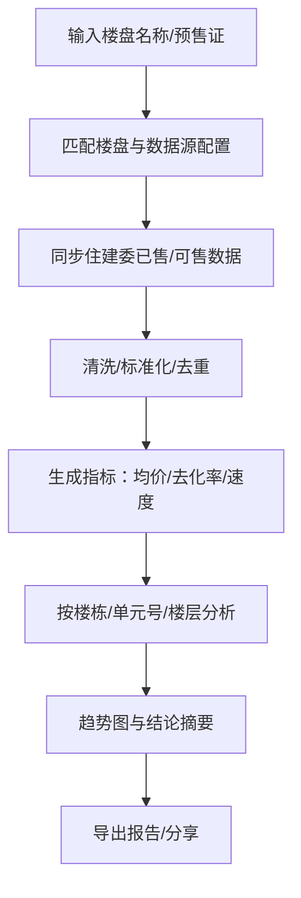

## 1. 产品概述
面向购房者与置业顾问的楼盘成交情报与趋势分析工具，通过住建委官网的已售/可售房源信息，快速还原真实成交与去化走势。
- 解决问题：信息分散、成交价不透明、户型/单元成交难追踪、趋势难量化
- 目标用户：个人购房者、家庭决策者、置业顾问/渠道、内部研究人员
- 产品价值：用“可追溯的数据链路 + 可解释的估算方法”降低决策不确定性

## 2. 核心功能

### 2.1 用户角色（适用）
| 角色 | 使用方式 | 核心权限 |
|------|----------|----------|
| 普通用户 | 直接使用（可选免登录） | 搜索楼盘、查看成交/去化趋势、导出报告 |
| 管理员 | 内部账号（可选） | 配置住建委数据源、字段映射/校验规则、抓取频率与限速 |

### 2.2 功能模块
1. **楼盘检索与关注**：按名称/区域/开发商检索；关注楼盘并固定到首页
2. **成交数据获取（住建委）**：按楼盘/预售证/楼栋获取已售房源、价格、套内面积、房号/单元号等
3. **数据清洗与可信度标记**：去重、字段标准化、异常值检测（例如价格缺失/面积异常/重复记录）
4. **成交与去化分析**：成交价分布、楼栋/单元/楼层对比、单元号成交梳理、去化率与速度
5. **趋势与结论输出**：按日/周/月趋势；一键生成“当前成交区间 + 热点单元/楼栋 + 风险提示”
6. **导出与分享**：导出 PDF/图片/CSV（可选），用于家庭讨论或内部汇报

### 2.3 页面详情
| 页面名称 | 模块名称 | 功能描述 |
|---------|----------|----------|
| 首页（仪表盘） | 搜索/关注区 | 搜索楼盘；展示关注楼盘卡片、最近更新状态、关键指标（均价、去化率、近30日成交套数） |
| 首页（仪表盘） | 快速洞察 | 展示总体趋势图（成交套数、均价、去化速度）、异常提醒（价格跳变、数据断档） |
| 楼盘详情页 | 概览 | 楼盘信息（区域、预售证、楼栋）；数据更新时间、可信度说明 |
| 楼盘详情页 | 已售/可售列表 | 房源表格（楼栋/单元/房号/面积/状态/价格）；支持筛选与排序 |
| 楼盘详情页 | 成交分析 | 成交价分布、楼栋/单元号对比、楼层溢价、户型对比；可切换时间范围 |
| 楼盘详情页 | 趋势 | 成交套数/均价/去化率随时间变化；支持对比多个预售证或楼栋 |
| 数据源配置页 | 住建委配置 | 配置城市/站点入口、查询参数、验证码/反爬提示（如需人工辅助）、字段映射 |
| 数据源配置页 | 采集策略 | 抓取限速、重试、增量更新策略、失败告警（可选） |
| 报告页 | 报告生成 | 选择时间范围与维度，一键生成结论摘要与图表；导出/分享 |

## 3. 核心流程
用户核心路径：
1) 输入楼盘关键词检索并进入详情 → 2) 首次同步数据（或读取最近同步） → 3) 浏览已售/可售与价格 → 4) 按楼栋/单元号筛选分析 → 5) 查看趋势 → 6) 导出报告形成决策材料。

## 4. 用户界面设计

### 4.1 设计风格
- 风格方向：偏“金融数据终端”的克制深色系 + 少量高对比强调色，突出可读性与可信度
- 主色：深墨黑/深蓝灰；强调色：青绿或琥珀色用于涨跌与关键数值
- 按钮：窄圆角、低噪声阴影、明确的悬浮/按下状态
- 字体：标题使用具识别度的展示字体，正文使用高可读中文无衬线；数值使用等宽数字风格（若可用）
- 布局：顶部导航 + 左侧筛选（可折叠）+ 主区图表/表格；表格支持固定表头与列高亮
- 图标：线性图标为主，避免花哨；数值趋势用简洁箭头/火花线

### 4.2 页面设计概览
| 页面名称 | 模块名称 | UI 元素 |
|---------|----------|---------|
| 首页 | 关注楼盘卡片 | 楼盘名、状态徽标、关键指标、最后同步时间；卡片悬浮提升与细微光晕 |
| 楼盘详情 | 图表区 | 分布直方图/箱线图/折线；可切换维度与时间范围；图例可交互高亮 |
| 楼盘详情 | 房源表格 | 多列筛选、排序、列冻结；单元号分组折叠；异常值高亮与解释弹层 |
| 报告页 | 摘要区 | 3–5 条结论要点 + 风险提示；支持复制/导出 |

### 4.3 响应式
桌面优先；移动端适配：筛选抽屉化、表格转卡片/横向滚动、图表简化；触控操作与可点击区域加大。
