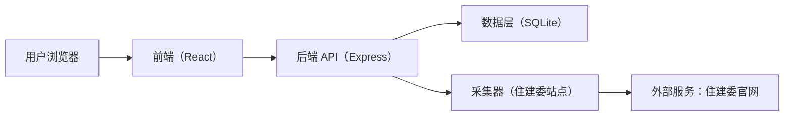
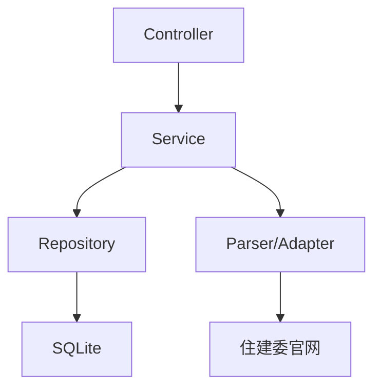
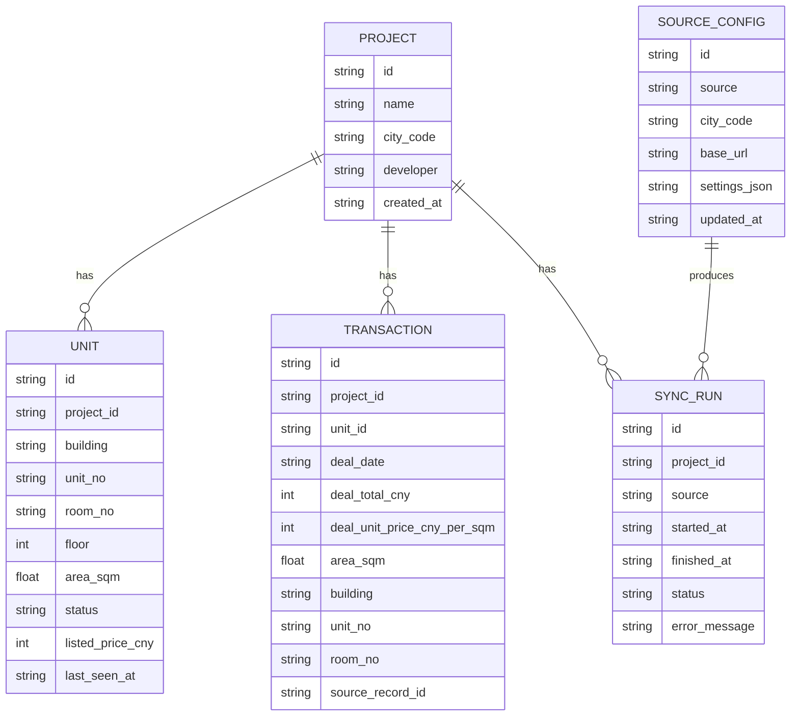

## 1. 架构设计



架构要点：
- 前端负责检索、筛选、可视化与报告导出交互
- 后端负责数据同步、清洗、分析计算、持久化与权限（如启用）
- 数据层采用本地 SQLite，便于部署与迁移；后续可替换为 Postgres
- 采集器以“增量同步 + 可观测的同步记录”为核心，便于追溯数据来源与时间

## 2. 技术说明
- 前端：React@18 + TypeScript + vite + tailwindcss
- 后端：Node.js + Express（TypeScript）
- 数据库：SQLite（本地文件），通过迁移脚本初始化
- 抓取/解析：HTTP 请求 + HTML 解析（按站点适配），内置限速、重试与错误分类
- 图表：前端图表库（在实现阶段根据可用依赖选择）

## 3. 路由定义
| 路由 | 目的 |
|------|------|
| / | 首页仪表盘（搜索、关注、概览指标） |
| /projects/:projectId | 楼盘详情（房源表格、成交分析、趋势） |
| /sources | 数据源配置（站点、参数、映射、同步策略） |
| /reports/:projectId | 报告生成与导出 |

## 4. API 定义

### 4.1 TypeScript 类型
```ts
export type Project = {
  id: string
  name: string
  cityCode: string
  developer?: string
  createdAt: string
}

export type UnitStatus = "sold" | "available" | "unknown"

export type Unit = {
  id: string
  projectId: string
  building?: string
  unitNo?: string
  roomNo?: string
  floor?: number
  areaSqm?: number
  status: UnitStatus
  listedPriceCny?: number
  source: "housing_commission"
  lastSeenAt: string
}

export type Transaction = {
  id: string
  projectId: string
  unitId?: string
  dealDate?: string
  dealTotalCny?: number
  dealUnitPriceCnyPerSqm?: number
  areaSqm?: number
  building?: string
  unitNo?: string
  roomNo?: string
  source: "housing_commission"
  sourceRecordId?: string
}

export type SyncRun = {
  id: string
  projectId: string
  source: "housing_commission"
  startedAt: string
  finishedAt?: string
  status: "success" | "failed" | "partial"
  stats: {
    unitsUpserted: number
    transactionsUpserted: number
    anomalies: number
  }
  errorMessage?: string
}
```

### 4.2 接口列表（初版）
| 方法 | 路径 | 说明 |
|------|------|------|
| GET | /api/projects?query= | 按关键词检索/列出楼盘 |
| POST | /api/projects | 创建楼盘（录入名称、城市等） |
| GET | /api/projects/:projectId | 获取楼盘基础信息与最新指标 |
| POST | /api/projects/:projectId/sync | 触发一次同步（可参数：预售证/楼栋范围） |
| GET | /api/projects/:projectId/units | 房源列表（筛选：楼栋/单元号/状态/价格区间） |
| GET | /api/projects/:projectId/transactions | 成交记录列表（筛选：时间范围、楼栋/单元号） |
| GET | /api/projects/:projectId/metrics | 聚合指标（均价、去化率、分布、趋势序列） |
| GET | /api/projects/:projectId/sync-runs | 同步历史与失败原因 |
| GET | /api/sources | 获取数据源配置 |
| PUT | /api/sources/housing-commission | 更新住建委配置（站点、字段映射、限速等） |

## 5. 服务端架构图



## 6. 数据模型

### 6.1 数据模型定义


### 6.2 数据定义语言（DDL）
```sql
CREATE TABLE IF NOT EXISTS projects (
  id TEXT PRIMARY KEY,
  name TEXT NOT NULL,
  city_code TEXT NOT NULL,
  developer TEXT,
  created_at TEXT NOT NULL
);

CREATE TABLE IF NOT EXISTS units (
  id TEXT PRIMARY KEY,
  project_id TEXT NOT NULL,
  building TEXT,
  unit_no TEXT,
  room_no TEXT,
  floor INTEGER,
  area_sqm REAL,
  status TEXT NOT NULL,
  listed_price_cny INTEGER,
  last_seen_at TEXT NOT NULL,
  FOREIGN KEY(project_id) REFERENCES projects(id)
);

CREATE INDEX IF NOT EXISTS idx_units_project_id ON units(project_id);
CREATE INDEX IF NOT EXISTS idx_units_project_unit_no ON units(project_id, unit_no);

CREATE TABLE IF NOT EXISTS transactions (
  id TEXT PRIMARY KEY,
  project_id TEXT NOT NULL,
  unit_id TEXT,
  deal_date TEXT,
  deal_total_cny INTEGER,
  deal_unit_price_cny_per_sqm INTEGER,
  area_sqm REAL,
  building TEXT,
  unit_no TEXT,
  room_no TEXT,
  source_record_id TEXT,
  FOREIGN KEY(project_id) REFERENCES projects(id),
  FOREIGN KEY(unit_id) REFERENCES units(id)
);

CREATE INDEX IF NOT EXISTS idx_tx_project_date ON transactions(project_id, deal_date);
CREATE INDEX IF NOT EXISTS idx_tx_project_unit ON transactions(project_id, unit_no);

CREATE TABLE IF NOT EXISTS sync_runs (
  id TEXT PRIMARY KEY,
  project_id TEXT NOT NULL,
  source TEXT NOT NULL,
  started_at TEXT NOT NULL,
  finished_at TEXT,
  status TEXT NOT NULL,
  error_message TEXT,
  stats_json TEXT NOT NULL,
  FOREIGN KEY(project_id) REFERENCES projects(id)
);

CREATE INDEX IF NOT EXISTS idx_sync_runs_project_id ON sync_runs(project_id);

CREATE TABLE IF NOT EXISTS source_configs (
  id TEXT PRIMARY KEY,
  source TEXT NOT NULL,
  city_code TEXT NOT NULL,
  base_url TEXT NOT NULL,
  settings_json TEXT NOT NULL,
  updated_at TEXT NOT NULL
);

CREATE UNIQUE INDEX IF NOT EXISTS idx_source_configs_source_city ON source_configs(source, city_code);
```
